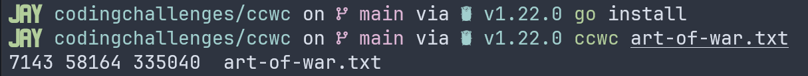

# Intro
Welcome to my blog series Coding Challenges, where I will be documenting my thought process of working through the [Coding Challenges by John Crickett](https://codingchallenges.fyi/challenges/intro) using Go and Test Driven Development. I am very excited about this series as I have always wanted to find something similar to what John have done. 

This is very different from the coding challenges you may have encountered before. John created a curated list of very interesting tools/applications, and I highly recommend you to check those out. I love building stuff and I figure this would be a great opportunity for me to practice TDD and practice documenting my thought process.


# The Challenge
This first exercise is to create my own version of the Unix tool `wc`.

>The Unix command line tools are a great metaphor for good software engineering and they follow the Unix Philosophies of:
>
>- Writing simple parts connected by clean interfaces - each tool does just one thing and provides a simple CLI that handles text input from either files or file streams.
>- Design programs to be connected to other programs - each tool can be easily connected to other tools to create incredibly powerful compositions.
>
>Following these philosophies has made the simple unix command line tools some of the most widely used software engineering tools - allowing us to create very complex text data processing pipelines from simple command line tools
>
> John Crickett - https://codingchallenges.fyi/challenges/challenge-wc

My application will be called `ccwc` (coding challenge wc) and the steps to complete the challenge are the following:
1. Output the number of bytes `ccwc -c test.txt`
2. Output the number of lines `ccwc -l test.txt`
3. Output the number of words `ccwc -w test.txt`
4. Output the number of characters `ccwc -m test.txt`
5. Default usage `ccwc test.txt`: Output number of lines, words and, bytes
6. Read from `stdin`


*_The code snippets here may not be 100% what I have in my repository. I am still grasping the whole idea of documenting while developing, and the chances of me forgetting to update the snippets are high. The final version of the code is in my [repository](https://github.com/jaymorelli96/codingchallenges)_
# Development Process
### TDD Ranting
I just want to brief clarify something. I don't and won't follow the TDD rigorously, at least for now. I like to think that we must be pragmatic about it and I am also not great at it. Furthermore, I get the most value from TDD when:
1. I am iterating
2. My software is tested

I understand that this is the whole point of TDD, but _I am ok if sometimes I miss one of the steps or end up rushing it a little bit_.

## Step Zero
I start by reading about the `wc` tool.
```bash
$ man wc
```
After reading the manual and with a clear understand of the tool, I open my Obsidian and I write down the necessary the steps needed to accomplish the goal.

I open up my terminal, set up my project and open my beloved NeoVim.

## Step One - Counting Bytes
I start with my tests, feeling unsure about what I want to test and where to begin. 

Knowing that I need a file for testing, I decide to use the `fstest` library provided by Go.

My initial test looks like this:
```go
func TestReadFile(t *testing.T) {
	files := fstest.MapFS{
		"file1": {Data: []byte("abc")},
		"file2": {Data: []byte("def")},
		"file3": {Data: []byte("joão")},
	}

	type test struct {
		file string
		want []byte
	}

	tt := []test{
		{"file1", []byte("abc")},
		{"file2", []byte("def")},
		{"file3", []byte("joão")},
	}

	for _, tc := range tt {
		file, err := files.Open(tc.file)
		if err != nil {
			t.Fatal(err)
		}

		got, n, err := ReadFile(file)
		if err != nil {
			t.Fatal(err)
		}

		if !equalBytesFromFile(n, got, tc.want) {
			t.Errorf("readFile(%s) = %s; want %s", file, got, tc.want)
		}
	}
}
```

I go ahead and write the `ReadFile` function to get the green signal (tests are passing). 
```go
func ReadFile(file fs.File) ([]byte, int, error) {
	b := make([]byte, 1024)
	n, err := file.Read(b)
	if err != nil {
		return nil, 0, err
	}

	return b, n, nil
}

```
After writing the `ReadFile` function and ensuring that my tests pass, I realize that my approach is inadequate. I've essentially created a wrapper around `file.Read()` without testing the core functionality I need.

*This is the beauty of TDD!*

What I really want to test at this point is that my function can:
1. Open a file
2. Count the bytes: Actually what I really want is to **write the number of bytes somewhere, so that I can test that output with my test cases**.

At this point, I notice something very interesting: I need to _read_ and _write_. This is the perfect use case to take advantage of the `Reader` and `Writer` interface. I can simply write to some buffer for testing and when I run my program I can write to standard output. The same applies for reading the input.

I update my test function.
```go
func TestWordCountNumberOfBytes(t *testing.T) {
	files := fstest.MapFS{
		"file1": {Data: []byte("abc")},
		"file2": {Data: []byte("")},
		"file3": {Data: []byte("joão")},
	}

	type test struct {
		file string
		want string
	}

	tt := []test{
		{"file1", "3"},
		{"file2", "0"},
		{"file3", "5"},
	}

	for _, tc := range tt {
		file, err := files.Open(tc.file)
		if err != nil {
			t.Fatal(err)
		}
		defer file.Close()

		var b bytes.Buffer

		err = WordCount(file, &b)
		if err != nil {
			t.Fatal(err)
		}

		if b.String() != tc.want {
			t.Errorf("got %s; want %s", b.String(), tc.want)
		}
	}
}

```

I update my function to get rid of the compile errors and go for the green signal.
```go
func WordCount(r io.Reader, w io.Writer) error {
	b := make([]byte, 1024)
	n, err := r.Read(b)
	if err != nil {
		if err != io.EOF {
			return err
		}

		return fmt.Fprint(w, 0)
	}

	_, err = fmt.Fprint(w, n)
	return err
}
```


After making these changes, the functionality is in place. However, I still need to add support for accepting the -c flag as an argument. I update my test and function accordingly.
```go
func TestWordCountNumberOfBytes(t *testing.T) {
//...
		opts := options{c: true}
		var b bytes.Buffer

		got, err := WordCount(file, &b, opts)
		if err != nil {
			t.Fatal(err)
		}
//...
}
```

```go
package main

import (
	"fmt"
	"io"
)

type options struct {
	c bool
}

func WordCount(r io.Reader, w io.Writer, opts options) error {
	b := make([]byte, 1024)
	n, err := r.Read(b)
	if err != nil {
		if err != io.EOF {
			return err
		}

		return writeBytes(w, 0)
	}

	if opts.c {
		err = writeBytes(w, n)
	}

	return err
}

func writeBytes(w io.Writer, n int) error {
	_, err := fmt.Fprint(w, n)
	return err
}

```

## Step two: Counting number of lines
I begin this step by creating failing tests to count the number of lines in a file.
```go
func TestWordCountNumberOfLines(t *testing.T) {
	files := fstest.MapFS{
		"file1": {Data: []byte("abc\ndef")},
		"file2": {Data: []byte("")},
		"file3": {Data: []byte("one line")},
		"file4": {Data: []byte("joão\n\n")},
	}

	type test struct {
		file string
		want string
	}

	tt := []test{
		{"file1", "2"},
		{"file2", "0"},
		{"file3", "1"},
		{"file4", "3"},
	}

	for _, tc := range tt {
		file, err := files.Open(tc.file)
		if err != nil {
			t.Fatal(err)
		}
		defer file.Close()

		opts := options{l: true}
		var b bytes.Buffer

		err = WordCount(file, &b, opts)
		if err != nil {
			t.Fatal(err)
		}

		if b.String() != tc.want {
			t.Errorf("got %s; want %s", b.String(), tc.want)
		}
	}
}

```

After fixing compile errors and observing failing tests, I start to think about the easiest way to make the test pass.

Realizing that I'll need to also write numbers and not just bytes, I rename the writeBytes function to write for clarity. Then, I update the WordCount function to handle counting lines:
```go
func WordCount(r io.Reader, w io.Writer, opts options) error {
	b := make([]byte, 1024)
	n, err := r.Read(b)
	if err != nil {
		if err != io.EOF {
			return err
		}

		return write(w, 0)
	}

	if opts.c {
		err = write(w, n)
	}

	if opts.l {
		count := 1 // unless empty, we always start with one line
		for _, v := range b {
			if v == '\n' {
				count++
			}
		}

		err = write(w, count)
	}

	return err
}
```
## Step Three: Counting Words
As usual, I begin with a test.
```go
func TestWordCountNumberOfWords(t *testing.T) {
	files := fstest.MapFS{
		"file1": {Data: []byte("abc\ndef\n")},
		"file2": {Data: []byte("\n")},
		"file3": {Data: []byte("thisisonebigword")},
		"file4": {Data: []byte("five words and two lines\n\n")},
		"file5": {Data: []byte("abc def")},
	}

	type test struct {
		file string
		want string
	}

	tt := []test{
		{"file1", "2"},
		{"file2", "0"},
		{"file3", "1"},
		{"file4", "5"},
		{"file5", "2"},
	}

	for _, tc := range tt {
		file, err := files.Open(tc.file)
		if err != nil {
			t.Fatal(err)
		}
		defer file.Close()

		opts := options{w: true}
		var b bytes.Buffer

		err = WordCount(file, &b, opts)
		if err != nil {
			t.Fatal(err)
		}

		if b.String() != tc.want {
			t.Errorf("got %s; want %s", b.String(), tc.want)
		}
	}
}
```

Realizing that defining words as non-white space characters suits this problem, I decide to use `bytes.Fields` from the `strings` package to split the byte slice into words. 
However, I encounter a challenge when initializing the buffer `b := make([]byte, 1024)`. I must consider the unread portion of the slice.
```go
func WordCount(r io.Reader, w io.Writer, opts options) error {
	b := make([]byte, 1024)
	n, err := r.Read(b)
	if err != nil {
		if err != io.EOF {
			return err
		}

		return write(w, 0)
	}

	b = b[:n] // slicing out the unread portion 

	if opts.c {
		err = write(w, n)
	}

	if opts.l {
		count := 1
		for _, v := range b {
			if v == '\n' {
				count++
			}
		}

		err = write(w, count)
	}

	if opts.w {
		f := bytes.Fields(b)
		err = write(w, len(f))
	}

	return err
}
```

## Step Four: Counting Characters
I was a bit confused between `-m` and `-c`, so I decided to read the manual for `wc`. For example (ç) counts as 2 bytes but 1 character. With that in mind, I discover that the `utf8` package provides the `Count(b []byte) int` method, which fits perfectly the use case.

I won't show the tests anymore as it is pretty similar to the rest. 

This is a snippet of the `WordCount` where it contains the logic for the `-m` argument.
```go
//...
	if opts.m {
		n := utf8.RuneCount(b)
		err = write(w, n)
	}
//...
```

## Step Five: Default Option
This is the time for us to refactor, as I need to be able to format the output and set the default options.

The `WordCount` at the end looks like this:
```go
func WordCount(r io.Reader, w io.Writer, opts options) error {
	var buf bytes.Buffer
	_, err := io.Copy(&buf, r)
	if err != nil {
		if err != io.EOF {
			return err
		}

		handleEmptyFile(w, opts)

		return nil
	}

	b := buf.Bytes()

	if opts.l {
		count := bytes.Count(b, []byte{'\n'})
		fmt.Fprintf(w, "%d ", count)
	}

	if opts.w {
		f := bytes.Fields(b)
		fmt.Fprintf(w, "%d ", len(f))
	}

	if opts.c {
		fmt.Fprintf(w, "%d ", len(b))
	}

	if opts.m {
		n := utf8.RuneCount(b)
		fmt.Fprintf(w, "%d ", n)
	}

	return err
}

func handleEmptyFile(w io.Writer, opts options) {
	if opts.c {
		fmt.Fprintf(w, "0 ")
	}
	if opts.l {
		fmt.Fprintf(w, "0 ")
	}
	if opts.w {
		fmt.Fprintf(w, "0 ")
	}
	if opts.m {
		fmt.Fprintf(w, "0 ")
	}

```

## Running the program
All the code is [my repository](https://github.com/jaymorelli96/codingchallenges/tree/main/ccwc), feel free to check it out.

I install my program with `go install` and I test against the `art-of-war.txt`



# Outro
At the last step I completly forgot to document my process as it happened a few days later. For the next challenges I will try to write a post per step and not per challenge as 
it gets quite hard to put it all together.

Overall I really enjoyed this experience and I am very excited to go through the whole list of coding challenges.
